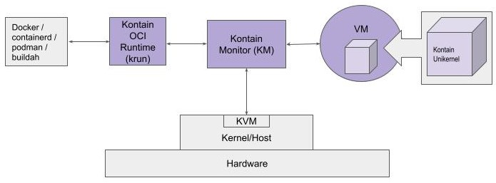

Regular 
Nightly 

# Kontain

Kontain is the way to run container workloads "Secure, fast and small—choose three." Kontain runs workloads with Virtual Machine level isolation/security, but without traditional VM overhead; in fact, we generate smaller artifacts and much faster startup times than "classic" Docker containers.  Kontain works by wrapping your code into a unikernel executable that is packaged as a container.

Use cases for Kontain include ML inferencing, serverless/FaaS computing, mobile edge cloud, healthcare, financial services, and ecommerce.  If you’re wanting to use containers for your application, but are sensitive to security, performance, and scalability, and production capital/operating expenses, Kontain may be for you.

Kontain is currently in beta testing.

## Product Releases 
https://github.com/kontainapp/km-releases/releases/ 

## Supported Linux Platforms

Kontain runs on Linux hosts that meet these minimum requirements: 

*   CPU: Intel or AMD
*   Linux kernel: Version 4.15 or higher
*   Distribution: Ubuntu 20 and Fedora 32 (or newer) are recommended
*   Virtualization enabled, using either: 
    *   Hardware virtualization, with KVM installed and enabled (requires stock kernel module on Linux kernel 4.15 or higher), or
    *   Kontain Kernel Module (KKM) (included in the Kontain release) 

## Installing Kontain
Kontain can be installed directly on the host or in a VM. 

For a quick and easy way to start exploring Kontain, we recommend using one of the pre-configured Kontain VMs available from Vagrant Cloud:

*   [Ubuntu 20.10](https://app.vagrantup.com/kontain/boxes/ubuntu2010-kkm-beta3)
*   [Fedora 32](https://app.vagrantup.com/kontain/boxes/fedora32-kkm-beta3)

The Vagrant VM brings fully functional Kontain to your desktop or laptop and provides a stable platform for exploration and validation:

*   Kontain pre-installed 
*   KKM (Kontain kernel module) to support nested virtualization
*   Docker pre-installed and configured for use with Kontain
*   Compatible with Windows, Linux, and Mac OS

Prerequisite: Both [Vagrant](https://www.vagrantup.com/) and [VirtualBox](https://www.VirtualBox.org/) must be installed on your host machine. 

Instructions: [https://app.vagrantup.com/kontain](https://app.vagrantup.com/kontain)

## Kontain System Overview

Figure 1. Kontain System Diagram

Kontain’s implementation of an OCI Runtime compliant container interface is *`krun`* (based on RedHat `crun`), which is used to build and run an application as a Kontain unikernel in a nested VM. 
*   `krun` can be invoked from Docker, Podman, and other container management tools. 
*   `krun` can also be used to run kontainers directly.

A _Kontain unikernel_ is the application code packaged with the Kontain runtime library. At runtime, this small, executable artifact runs in a Kontain VM. 

Kontain provides tools to build unikernels that are optimized for container use cases. Packaging this workload-optimized unikernel as an OCI-compliant container image yields what we call a _kontainer_. 

The _Kontain virtual machine Monitor_ (KM) is a user-space application that interfaces with the hardware via system calls. KM initializes Kontain VM facilities, loads the _unikernel image_ into VM memory, and runs the workload inside the VM. This dedicated VM is ephemeral, existing only to support one instance of a _kontainer_.

The _Kontain VM_ provides hardware resources (CPU, memory) to the application. Kontain VMs interact with the outside world via a limited set of hypercalls to the Kontain Monitor, which manages requests from the application as it runs.

A Kontain VM is optimized to provide the workload with just the features it needs to execute—mainly CPU and memory.  The Kontain VM model dynamically adjusts to application requirements, for example, growing and shrinking memory to meet the application’s demands and adding and removing virtual CPUs as the application manipulates thread pools. The Kontain Monitor spawns additional KM processes as needed to manage dedicated VMs.

## Getting Started Using Kontain

You can package your application to run in a Kontain VM, with or without using containers and container management tools such as Docker and RedHat Podman. 

In general, a Linux executable built using musl libc runtime (e.g. for Alpine Linux) runs under Kontain, unmodified, as a unikernel. 

Kontain supports running an unmodified Go program as a unikernel, provided the executable does not use glibc. 

C and C++ programs can be converted to a unikernel by relinking your code or object files with the Kontain runtime library. Kontain provides convenience wrappers `kontain-gcc` (`kontain-g++`) to produce a statically linked unikernel that contains all of the code needed for the workload to run.

An _interpreted language program_ can be run as a Kontain unikernel using pre-built Java, Python, and Node.js executables (kontainers). These [pre-built Kontain images are available on Docker Hub](https://hub.docker.com/u/kontainapp), listed as `kontainapp/runenv-<language>:`

*   Jdk-11.0.8
*   Node-12.4 (js)
*   Python-3.7

These unikernels contain the unmodified executable linked with Kontain libraries and packaged as a Docker image for use in your container. 

You can use Docker to build and package your interpreted language application files with Kontain runtime into a new kontainer, then run the workload as a unikernel using `docker run` with the `-runtime krun` flag. 

Alternatively, you can pass your application files to a kontainer created from a Kontain pre-built unikernel, which allows you to bypass the step of creating a new kontainer with your code. You run your application using `docker run` or extract the files from the container and run locally, without Docker. 

Further details and examples are provided in the [*Kontain User Guide*](https://github.com/kontainapp/km/blob/master/docs/user-guide.md).

## User Documentation

Command-line help: `/opt/kontain/bin/km --help`

[*Kontain User Guide*](https://github.com/kontainapp/km/blob/master/docs/user-guide.md) Provides information for installing Kontain and using it to run workloads. 
 
[*Debugging Kontain Unikernels*](https://github.com/kontainapp/km/blob/master/docs/debugging-guide.md) Provides information about how to debug a Kontain workload (unikernel) using standard debugging tools and practices.  

[*Known Issues*](https://github.com/kontainapp/km/blob/master/docs/known-issues.md) 

[*FAQs*](https://github.com/kontainapp/km/blob/master/docs/FAQ.md)

## Contributing
Kontain is open source: We encourage you to work with the source code and provide feedback!

Have a general comment or question about KM? Want to contribute a use case? Email us: <community@kontain.app>

We accept PRs [here](https://github.com/kontainapp/km/pulls). To view/report issues, go [here](https://github.com/kontainapp/km/issues).

To learn about our development process, including how to set up the build environment, then build and test KM, see [BUILD.md](https://github.com/kontainapp/km/blob/master/docs/build.md). 

Please refer to [CONTRIBUTING.md](https://github.com/kontainapp/km/blob/master/CONTRIBUTING.md) for general guidelines and conventions. 
 
IMPORTANT: All contributions are subject to the terms of the kontainapp/km licensing agreement (see link below). 
## Licensing
Copyright © 2021 Kontain Inc. All rights reserved.

kontainapp/km is licensed under the [Apache 2.0 license](https://github.com/kontainapp/km/blob/master/LICENSE). 
