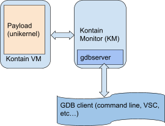
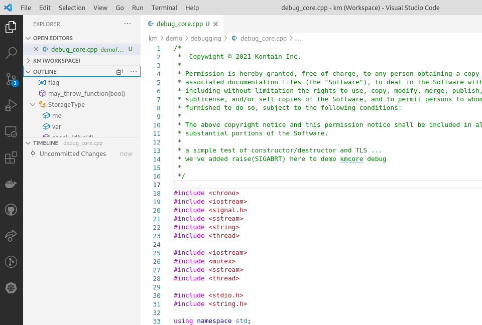

# Debugging Kontain Unikernels

## About This Document

This document provides information for developers about how to debug a Kontain workload (unikernel) using standard debugging tools and practices.  Please refer to the [*Kontain User Guide*](user-guide.md) for an introduction to the Kontain solution.

## Kontain Debugging Basics

Debugging unikernels can be a complex task, and the lack of GDB/IDE debugging has been as a shortcoming of the unikernel approach. This complaint about unikernels does not apply to Kontain.

Kontain supports _full GDB debugging_, including the use of GDB-based IDEs. For example, you can use the Visual Studio Code debugger to debug C++ code running as a Kontain unikernel. For interpreted languages, such as Javascript (in node.js) and Python, you can use native debuggers (e.g. `node --inspect` or `python -m pdb`) by connecting to the interpreter running as a unikernel.

The Kontain Monitor (KM) is responsible for creating a VM and running a workload unikernel in the VM. KM implements a built-in GDB server, so the GDB client is actually talking to KM, as shown in Figure 1. KM fully controls execution of the workload—starting, stopping, memory inspection, breakpoints, etc.—and it provides debugging information via the VM to the GDB client.



Figure 1. Kontain’s Built-In GDB Server Supports Full GDB Debugging

In this document, we provide examples of debugging an application running in Kontain VM, as well as analyzing core dumps produced by the application.

For more information about the GDB commands referenced in this document, see: [Debugging with GDB](https://sourceware.org/gdb/current/onlinedocs/gdb/).

For information about using Visual Studio Code using C++, see: [Get Started with C++ on Linux](https://code.visualstudio.com/docs/cpp/config-linux).

For information about the Kontain commands referenced in this document, type: “`/opt/kontain/bin/km --help`”.

## Analyzing KM Core Dumps
A workload running as a unikernel in Kontain VM will generate a core dump in the same cases it would when running on Linux.

You can use Visual Studio Code to analyze a Kontain core dump just as you would analyze a Linux core dump.

You can also use standard system GDB to analyze a KM core dump.

EXAMPLE:

```
gdb program.km kmcore
```

Where `kmcore` is the file name in Kontain.

NOTE: By default, KM will save a core dump to `kmcore` in the current directory. You can designate a different file name using the `km` command with the `--coredump=file` flag, where `file` is the desired file name. When multiple KMs are running, having different file names can help you determine which KM has coredumped. 


## Debugging C/C++ using VS Code

This is a step-by-step demonstration of how to build, run, and debug C or C++ code as a unikernel running in a Kontain VM using Visual Studio Code.
We are using the [C++ code (.cpp file) provided in the Appendix ](#c-example-code), which includes `raise(SIGABRT);` to generate a core dump for the purpose of this demo.

**Prerequisites:**
*   Kontain is installed using the _[pre-configured Kontain Vagrant box](https://app.vagrantup.com/kontain/boxes/ubuntu-kkm-beta3)_.
*   Visual Studio Code (VSC) _[with Microsoft C/C++ extension](https://code.visualstudio.com/docs/languages/cpp)_.

**Setup:**
In the VS Code editor
1. Create a folder for Kontain debugging and `cd` to that folder.
2. Create a file named `debug_core.cpp` using the [code in the appendix](#c-example-code).
3. Add the folder to VS Workspace and save the workspace.


### Build the Application

You can use a _[VS Code Task](https://code.visualstudio.com/docs/editor/tasks)_ to build a Kontain unikernel (`.km` file) from unmodified C++ code, just as you would use a Task to build any other C++ program.
1. Add a VS Code Task to automate the program build. This build task will be called “Kontain C/C++: build active file”, and it will instruct VS Code to link the object files with the Kontain runtime library to create a Kontain unikernel. The output will be called `debug_core.km`

NOTE: We are using Kontain’s GCC wrapper for the linking operation.
    Use **Terminal > ConfigureTask** or add the following code to your `tasks.json` file:
```
{
    "type": "cppbuild",
    "label": "Kontain C/C++: build active file",
    "command": "/opt/kontain/bin/kontain-g++",
    "args": [
       "-g",
       "-pthread",
       "${file}",
       "-o",
       "${fileDirname}/${fileBasenameNoExtension}.km"
    ],
    "options": {"cwd": "${workspaceFolder}" },
    "problemMatcher": [ "$gcc" ],
    "group": { "kind": "build", "isDefault": true },
    "detail": "/opt/kontain/bin/kontain-g+++"
 }
```
2. With the `debug_core.cpp` file open in the Visual Studio editor, run the newly created `Kontain C/C++: build active file` task using the **Run Build Task** command (`Ctrl+Shift+B`). You will see the command running in the **Terminal** window:


The unikernel is built and placed in the file `debug_core.km`. It can now be run in Kontain VM.

### Run the Application

For this debugging demonstration, we will run the application and generate a core dump.

From a command line, run the unikernel you just created by typing “`km debug_core.km`”. Since we’ve added “`raise(SIGABRT);`” to the source code, the workload will crash and generate a `kmcore` file.

Note: Since we are not interested in program output for this demo, redirect to `/dev/null`:


### Analyze the Core Dump

Analyze the core dump using the `kmcore` file and [Visual Studio Code debugging support for C/C++.](https://code.visualstudio.com/docs/cpp/cpp-debug)

1. Configure VS Code to launch the C++ debugger for the core dump of the unikernel. Add the following debug configuration to `launch.json`:

```
{
        "name": "(core) Kontain workload core dump",
        "type": "cppdbg",
        "request": "launch",
        "program": "${fileDirname}/${fileBasenameNoExtension}.km",
        "args": [],
        "coreDumpPath": "${fileDirname}/kmcore",
        "stopAtEntry": true,
        "cwd": "${fileDirname}",
        "environment": [],
        "externalConsole": false,
        "MIMode": "gdb",
        "setupCommands": [
           {
              "description": "Enable pretty-printing for gdb",
              "text": "-enable-pretty-printing",
              "ignoreFailures": true
           }
        ]
     }
```
2. Start a debugging session in VS Code. Select "`(core) Kontain workload core dump`" in the **Run and Debug** dropdown, then select the **Run** icon (green triangle) or use `Ctrl+Shift+D`):


3. Now you can start a full investigation of the core dump in the visual debugger. Note that all threads, variables, etc. are visible, and all debugger features are available. (When you’re ready, stop the core dump investigation and proceed to the next example.)


### Live Debugging in VS Code

In this example, we will use VS Code to debug a workload running live as a Kontain unikernel in a Kontain VM. Kontain Monitor (KM) controls execution of the workload and provides workload-in-VM information to VS Code (the GDB client). The debugging experience is the same as for any other C++ program.

Note that we are using the C++ program from the previous example.

1. Configure VS Code; add the following configuration to your `launch.json`:

```
     {
        "name": "(gdb) Kontain launch of current file",
        "type": "cppdbg",
        "request": "launch",
        "cwd": "${workspaceFolder}",
        "program": "${fileDirname}/${fileBasenameNoExtension}.km",
        "args": [
           "set debug remote 0"
        ],
        "stopAtEntry": true,
        "miDebuggerServerAddress": "localhost:2159",
        "miDebuggerArgs": "--silent",
        "debugServerPath": "/opt/kontain/bin/km",
        "debugServerArgs": "-g ${fileDirname}/${fileBasenameNoExtension}.km",
        "serverLaunchTimeout": 5000,
        "filterStderr": true,
        "filterStdout": true,
        "serverStarted": "GdbServerStubStarted",
        "logging": {
           "moduleLoad": false,
           "trace": false,
           "engineLogging": false,
           "programOutput": true,
           "exceptions": true,
           "traceResponse": false
        },
        "environment": [],
        "externalConsole": false,
        "setupCommands": [
           {
              "description": "Enable pretty-printing for gdb",
              "text": "-enable-pretty-printing",
              "ignoreFailures": true
           }
        ]
     }
```
2. Select the new configuration and start a new debug session. The debugger starts the Kontain VM and stops at `main()`:


3. Although you are debugging a unikernel running in Kontain VM, the debugging experience in VS Code is the same as for any other C++ program. For example, we can add a breakpoint, then select **Continue** (**F5**):


## Live Debugging from the Command Line

To attach a standard GDB client to a Kontain workload, you need to instruct the Kontain Monitor GDB server to listen for a client connection.

The following flags control Kontain Monitor activation of the internal GDB server:

`-g[port]` - Starts the gdbserver, but instructs it to stop before the workload entry point and wait for the GDB client to connect; the default port is 2159.

`--gdb_listen` - The workload is allowed to run right away, but the KM GDB server will wait in the background for a GDB client connection.

You can connect to the GDB server, disconnect, and reconnect as often as you wish until the workload completes. When you connect to the KM GDB server, all workload threads will be paused until the GDB client starts them using the `cont`, `step`, or `next` command.

NOTE: KM uses a dedicated signal (currently # 63) to coordinate and pause workload threads. To avoid GDB program stops on this internal signal, use GDB `handle nostop`, for example:

 `handle SIG63 nostop`

This instruction can be used at each debugging session, or you can add it to the `~/.gdbinit` file.

For information about Kontain commands go to:  \
`/opt/kontain/bin/km --help`

*Known Limitation:* GDB follow-fork-mode cannot be used to follow the child process after a fork. To enable debugging of a child process, you can add a variable to the parent KM environment. For more information, see “[Debugging Child Processes and exec Workloads](#debugging-child-processes-and-exec-workloads).”

### EXAMPLE: Debugging a Workload with KM GDB

1. Start a workload from KM with GDB debugging enabled, e.g.,

```
[someone@work ~]$ /opt/kontain/bin/km -g ./tests/hello_test.km
```
KM will respond with connection instructions, e.g.,    
```
./tests/hello_test.km: Waiting for a debugger. Connect to it like this:
        gdb -q --ex="target remote localhost:2159" ./tests/hello_test.km
GdbServerStubStarted
```
2. Use the information provided by KM to attach the GDB client to the workload debugger, e.g.,

```
[someone@work ~]$ gdb -q --ex="target remote localhost:2159" ./tests/hello_test.km
Remote debugging using localhost:2159
Reading /home/someone/ws/ws2/km/tests/hello_test.km from remote target...
warning: File transfers from remote targets can be slow. Use "set sysroot" to access files locally instead.
Reading /home/someone/ws/ws2/km/tests/hello_test.km from remote target...
Reading symbols from target:/home/someone/ws/ws2/km/tests/hello_test.km...
0x0000000000201032 in _start ()
(gdb)
```
### **Restarting a Unikernel Debuggee**

Developers often need to restart a debuggee program from the beginning while preserving the breakpoints, variables, and other status in the client. In GDB, this is done using the `run` command. To achieve the same results when debugging with Kontain GDB, follow the procedure below.

**Procedure:**

1. In the GDB client, use the `detach` command to disconnect the debuggee and keep the client GDB alive.
2. In another shell, start the debuggee with KM debugging enabled, using the `-g` option as described in Step 1 of the example, above.
3. Returning to the GDB client, use the `target remote localhost:2159` command to attach to the freshly started debuggee. All of the breakpoints and other GDB client status should be present.
4. Run the debuggee using the `continue` command.

### Debugging Child Processes and `exec` Workloads

GDB follow-fork-mode cannot be used to follow the child process after a fork. This is because when a Kontain workload forks, it inherits debug settings from the forking process, e.g.,

*   If the parent waits for GDB `attach` before starting up, so will the child.
*   If the parent listens for a GDB client `attach` in the background, the child will do the same.
*   Each forked workload will be listening on a new network port.
    *   The new network port is the next free port that is higher than the parent's gdb network port.
    *   If most ports are in use, the port number will wrap at 64\*1024.
1. To enable debugging of a child process, add the following variable to the parent KM environment:

```
KM_GDB_CHILD_FORK_WAIT
```
The value of this variable is a regular expression that is compared to the name of the workload. If there is a match, the child process will pause and wait for the GDB client to connect to the KM GDB server.

2. Look up which port to connect to. This information is in a message from the child process KM and will look something like:

```
19:07:08.481122 km_gdb_attach_messag 319  1001.km      Waiting for a debugger. Connect to it like this:
        gdb -q --ex="target remote work:2160" /home/paulp/ws/ws2/km/tests/gdb_forker_test.km
GdbServerStubStarted
```

3. Attach using the following command:

```
gdb -q --ex="target remote localhost:2160"
```

When a workload process exec()s, the GDB `catch exec` command will allow the GDB client to gain control after the `exec` call successfully completes.

## Debugging Interpreted Languages (Python, JavaScript)

### Running Unmodified Scripts

There is no need to modify your scripts, but it’s useful to understand how Kontain supports scripts.

Often, scripts are packaged as “shebang” files, i.e., those starting with `#!/bin/python`. This sequence makes the Linux kernel invoke Python and pass the file content to it. In order to run all scripts unmodified, Kontain understands when a command (e.g. `python`) is a symlink to a KM executable; it automatically finds the correct unikernel and runs it.

For example, if you set the following file structure:
1. ‘`python`’ is a symlink to `/opt/kontain/bin/km`,
2. `python.km` (Python unikernel) is available in the same dir as the ‘`python`’ symlink,

Then running `python my-code.py` will actually run `my-code.py` in a Python unikernel in a Kontain VM, and the command line formed internally by KM will be `km python.km my-code.py`.

### Debug Servers

Interpreted languages usually have a debugging server in the interpreter and/or use a native debugging protocol over a dedicated network port. Therefore, having the port available to the workload is usually sufficient for debugging.

### Python Example

You can debug Python code using Visual Studio Code or directly with the ``debugpy`` module. There are two requirements:

*   debugpy must be installed.
*   Visual Studio Code` launch.json` must point to the correct Python interpreter (i.e. Python is a symlink to `/opt/kontain/bin/km`) as described in “[Running Unmodified Scripts](#running-unmodified-scripts),” above.
1. Configure VS Code. Here is an example `launch.json` configuration:

```
    {
        "name": "Python.km: Debugging Current Py File under KM",
        "type": "python",
        "request": "launch",
        "program": "${file}",
        "console": "integratedTerminal",
        "python": "${workspaceFolder}/workloads/python/cpython/python",
        "stopOnEntry": true
     }
```


2. Now you can visually debug Python code as a Python unikernel within Kontain VM, and the debugging experience will be the same as for any other Python program:


### Javascript (node.js) Example

Kontain supports Node.js debugging. In this example, we demonstrate a Node debugger attached to running Javascript code (started with `--inspect` flag).

**Setup Used for This Example:**

*   Kontain virtualization module (KKM). (We recommend that you use the prepared Ubuntu VM available from Vagrant Cloud, which includes KKM.)
*   A small http server: “`Hello from Node.js" `([code provided in the Appendix)](#nodejs-example-code).
*   Visual Studio “**Attach**” debug config, provided by Node support bundled in VS Code.
*   `curl localhost:8080`


## Debugging Golang

Currently, Kontain Golang unikernels can only be debugged with GDB, and [GDB support for Golang is weak](https://golang.org/doc/gdb). As a workaround, you can debug Go code natively on your platform, then run the debugged code as a unikernel by passing the file name to the `km `command.

<span style="text-decoration:underline;">Known Limitation</span>: Kontain only supports Go built with `CGO_ENABLED=0`. We are working to resolve known issues with `CGO_ENABLED=1`.

## Debugging on Mac and Windows

In this example debugging session, we’ll use Visual Studio Code to edit and debug the provided [example C++ code](#c-example-code) running in a Kontain VM.

**Prerequisites:**

1. Kontain installed using the provisioned Vagrant box (Ubuntu VM). Installation instructions are provided here: [kontainapp/km/km-releases](/km-releases).

    NOTE: Kontain’s Vagrant box is provided for Virtualbox only. If you want to use Hyper-V, please open an issue on [https://github.com/kontainapp/km/km-releases](/km-releases).

2. Visual Studio Code installed _with the [Remote Development extension pack](https://marketplace.visualstudio.com/items?itemName=ms-vscode-remote.vscode-remote-extensionpack)_.
3. Ensure that GCC is installed on the VM where Kontain is installed. Run `sudo apt-get install g++` on the VM (in the VS Code terminal). NOTE: This is part of VS Code setup; for more information, see [C++ programming with Visual Studio Code](https://code.visualstudio.com/docs/languages/cpp#_tutorials).

**Setup:**

1. Add the Ubuntu VM (with Kontain preinstalled) to ssh configuration as host “kontain”:

```
vagrant ssh-config --host kontain >>  ~/.ssh/config
```
2. Connect VS Code to the VM where Kontain is installed:


3. Add the example [.cpp file from the Appendix](#c-example-code) to the editor and save it.
4. Add the folder to VS Workspace and save it.

**Procedure:**

1. [Add a VS Code Task to automate the program build](#build-the-application). You can use **Terminal > ConfigureTask** or add the provided code into the `tasks.json` file.
2. [Add Kontain Debug Config](#analyze-the-core-dump) to the `launch.json` file.
3. Start a debugging session of the unikernel running in Kontain:


## Debugging a Kontainer with Docker

In this example, we’re going to debug a Node Express application in a kontainer under Visual Studio Code.

You can use Docker to build and run a Kontain workload, as a unikernel, in a kontainer. A *kontainer* is a Docker/OCI container with a Kontain unikernel (`node.km` in this case) in the container image, executed by the Kontain runtime (`krun`). As in a regular Docker workflow, a kontainer image is created using the `docker build` command. The standard executable in the container image is replaced with a Kontain unikernel. A kontainer is run by passing Kontain runtime (`krun`) to `docker run.`

**Prerequisites:**

*   Kontain, Docker, and Visual Studio Code are installed.

**Setup**:

Follow [Microsoft's example of running and debugging Node Express in Visual Studio](https://code.visualstudio.com/docs/containers/quickstart-node). You will then have a working app and a `Dockerfile` that can be run under Visual Studio debugger.

**Procedure:**

Because we want to support kontainers side-by-side with regular containers, we will create a new `Dockerfile,` some Visual Studio Tasks, and a Debug Configuration:

1. Create `Dockerfile.kontain`

    This file is based on auto-generated Dockerfiles. Here, we add `as base` to the first line, and added the second stage starting with `FROM kontainapp/runenv-node:latest`:

```
FROM node:12.18-alpine as base
ENV NODE_ENV=production
WORKDIR /usr/src/app
COPY ["package.json", "package-lock.json*", "npm-shrinkwrap.json*", "./"]
RUN npm install --production --silent && mv node_modules ../
COPY . .
EXPOSE 3000
CMD ["npm", "start"]

FROM kontainapp/runenv-node:latest
ENV NODE_ENV=production
# ENV KM_VERBOSE=exec
WORKDIR /usr/src/app
# COPY ["package.json", "package-lock.json*", "npm-shrinkwrap.json*", "./"]
COPY --from=base /usr/src/app/*json* ./
COPY --from=base /usr/src/node_modules /usr/src/node_modules/
COPY --from=base /usr/local/lib/node_modules/ /usr/local/lib/node_modules
RUN cd /usr/local/bin ; ln -s ../lib/node_modules/npm/bin/npm-cli.js npm
COPY . .
EXPOSE 3000
CMD ["npm", "start"]
```

2. Add Kontain Build and Run Tasks

    Add `docker-kbuild` and `docker-krun` to the `tasks.json` file:

```
     {
        "type": "docker-build",
        "label": "docker-kbuild",
        "platform": "node",
        "dockerBuild": {
           "dockerfile": "${workspaceFolder}/Dockerfile.kontain",
           "context": "${workspaceFolder}",
           "pull": false
        }
      },
      {
        "type": "docker-run",
        "label": "docker-krun: release",
        "dependsOn": [
           "docker-kbuild"
        ],
        "platform": "node",
        "dockerRun": {
           "customOptions": "--runtime=krun"
        }
     },
     {
        "type": "docker-run",
        "label": "docker-krun: debug",
        "dependsOn": [
           "docker-kbuild"
        ],
        "dockerRun": {
           "env": {
              "DEBUG": "*",
              "NODE_ENV": "development"
           },
           "customOptions": "--runtime=krun "
        },
        "node": {
           "enableDebugging": true
        }
     }
```

3. Add a Debug Config

    Add the following code to the `launch.json` file:

```
{
        "name": "Kontain Node.js Launch",
        "type": "docker",
        "request": "launch",
        "preLaunchTask": "docker-krun: debug",
        "platform": "node"
     }
```

4. Select “Kontain Node.js launch” in the **Run and Debug** menu to rebuild the kontainer (using the pre-built container image with the node unikernel) and run it with `--inspect` flags.


5. Debug the JavaScript code running in Kontain unikernel `node.km` under Visual Studio just as you would debug JavaScript code with regular Node.

    Follow Visual Studio guidelines at [Build and run a Node.js app in a container](https://code.visualstudio.com/docs/containers/quickstart-node).

## Appendix:  Source Code

### C++ Example Code

This is a very simple program from Kontain’s test set; it checks for the TLS constructors/destructors sequence. For the debugging demonstration, “`raise(SIGABRT);`” has been added to generate a core dump.

```c++
/*
*  Copyright © 2021 Kontain Inc.
*
* Permission is hereby granted, free of charge, to any person obtaining a copy of this software and
* associated documentation files (the "Software"), to deal in the Software without restriction,
* including without limitation the rights to use, copy, modify, merge, publish, distribute,
* sublicense, and/or sell copies of the Software, and to permit persons to whom the Software is
* furnished to do so, subject to the following conditions:
*
* The above copyright notice and this permission notice shall be included in all copies or
* substantial portions of the Software.
*
* a simple test of constructor/destructor and TLS ...
* we've added raise(SIGABRT) here to demo kmcore debug
*
*/

#include <chrono>
#include <iostream>
#include <signal.h>
#include <sstream>
#include <string>
#include <thread>

#include <iostream>
#include <mutex>
#include <sstream>
#include <thread>

#include <stdio.h>
#include <string.h>

using namespace std;
std::once_flag flag;

void may_throw_function(bool do_throw)
{
  std::stringstream msg;

  msg << std::this_thread::get_id()
      << "ONCE ONCE ONCE may_throw_function: Didn't throw, call_once will not attempt again\n";   // guaranteed once
  std::cout << msg.str();
}
class StorageType
{
  pthread_t me;
  int var;

  void check_id(void)
  {
     if (me != pthread_self()) {
        cout << "BAD THREAD STORAGE: me=" << std::hex << me << " self=" << std::hex
             << pthread_self() << endl;
     }
  }

public:
  string name;

  StorageType(const char* _n)
  {
     me = pthread_self();
     name = _n;
     cout << "calling once\n";
     std::call_once(flag, may_throw_function, false);
     pname("Constructor");
  }

  ~StorageType(void) { pname("Destructor"); }

  // void pname(void) { cout << "print name: " + name << endl; }
  void pname(string tag)
  {
     check_id();
     ostringstream id;
     id << "me=0x" << hex << me << " " << tag << " " << name << " thr=0x" << hex << pthread_self()
        << endl;
     cout << id.str();
  }
};

static StorageType t_GlobalStatic("Global static");
StorageType t_Global("Global visible");
static thread_local StorageType t_Tls("tls");

// for thread with entry function
void thread_entry(string n)
{
  string s = "thr " + n + " tls.name=" + t_Tls.name;
  t_Tls.pname(s.c_str());
  this_thread::sleep_for(chrono::seconds(1));   // helps to see the thread in GDB :-)
}

// For thread with callable entry
class check_tls
{
public:
  void operator()(string n)
  {
     string s = "Thread.operator() tls.name=" + t_Tls.name;
     cout << s << endl;
     t_Tls.pname(s.c_str());
  }
};

double toDouble(const char* buffer, size_t length)
{
  std::istringstream stream(std::string(buffer, length));
  stream.imbue(std::locale("C"));   // Ignore locale
  double d;
  stream >> d;
  return d;
}

int main()
{
  static StorageType t_LocalStatic("local Static");
  StorageType t_main("Local main");

  cout << "======> " << toDouble("1", 1) << endl;

  thread t1(thread_entry, "1");
  thread t2(thread_entry, "2");
  thread t3(check_tls(), "3+");

  t_main.pname("t_main");
  t_LocalStatic.pname("t_LocalStatic");
  t_Global.pname("t_Global");
  t_GlobalStatic.pname("t_GlobalStatic");

  t1.join();
  raise(SIGABRT);
  t3.join();
  t2.join();

  cout << "after join" << endl;
  cout.flush();

  return 0;
}

```
### Node.js Example Code
```js
var port = 8080;
var http = require('http');
var server = http.createServer(function(request, response) {
  if (request.method === "POST") {
     console.log('Got a POST, exiting');
     process.exit(0);
  }
  response.write('Hello from Node.js ')
  response.write(process.version);
  response.write('\n')
  response.end();
});
console.log('listening on port ', port)
server.listen(port);
```
