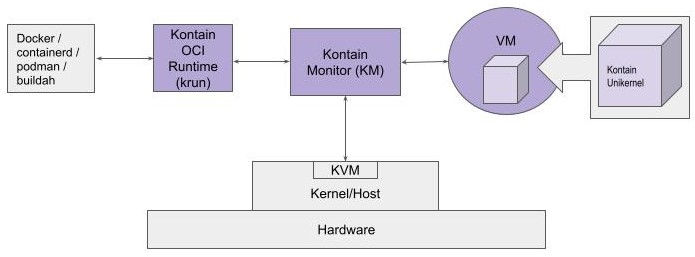

# Kontain User Guide

## About This Document
This document provides information for developers to install Kontain and use it to run workloads—either using the sample code provided in the Kontain release repository or using their own applications.

Reference [Kontain beta release](/)
[SP] this reference goes to subdirectory, which isn't too helpful. Where should it point to - back to the top?

## Introduction to Kontain
Containerization tools and processes provide the foundation for deploying today’s cloud-native software applications, but containers are still far from perfect for many modern workloads. For example, workloads that require very strong security isolation take on additional risk if they are run as containers on shared OS kernels.  Some workloads need to scale up—then scale down to zero—much quicker, more easily, and more cost-effectively than is possible using standard containers.

Kontain leverages existing container workflows, development tools, and processes, but builds containers with special characteristics:
*   Each process in each container runs in its own private virtual machine (VM), providing isolation and security
*   Each instance of each container starts fast—orders of magnitude faster than a regular VM, and close to the start time of a Linux process
*   A smaller container image—sometimes _much smaller_—than a standard container

Kontain is a way to run container workloads "secure, fast, and small — choose three."

### How Kontain Works

The Kontain solution is an integration of two technologies: containers and unikernels.

A _unikernel_ is a single-address-space machine image that contains an application workload—the program you want to run in a container—combined with a minimal set of library functions which provide the OS services required to run the workload.

Kontain provides a method for creating and running unikernels that are optimized for container use cases. Packaging this workload-optimized unikernel as an OCI-compliant container image yields what we call a _kontainer_.

A Kontain workload can be an unmodified Linux executable running as a unikernel or a unikernel created from source code relinked with Kontain libraries. _No source code modification is needed to create a kontainer._

For compiled languages (e.g. C/C++, Go), a unikernel kontainer is created by linking application object code with Kontain libraries.  For interpreted and bytecode-interpreted languages (e.g. Java, Python), a unikernel language runtime is created, then the interpreted/bytecode language is run inside the unikernel.

The Kontain solution includes an OCI-compatible runtime that, upon command, instantiates a virtual machine (VM) for the requested kontainer instance, loads the unikernel into the VM, then passes control to the unikernel.

Running a workload as a unikernel in a Kontain virtual machine provides VM-level isolation and security, _with none of the overhead of a traditional VM_.

A Kontain VM is optimized to provide the workload with just the virtual hardware it needs (CPU and memory) to execute. The VM interacts with the outside world via a limited set of hypercalls to the Kontain Monitor (KM).

By virtue of its small size and targeted functionality, a Kontain VM provides a secure environment for the application running inside. As an example, workloads running in a Kontain VM would have been immune to the Meltdown security flaw, even on unpatched kernels and CPUs.

### Compatible with Existing Container Workflows

Kontain seamlessly plugs into Docker and Kubernetes runtime environments.Kontain’s OCI-compliant image spec and runtime code ensure command-line and API compatibility with existing tools in your container workflow. Kontain requires little or no change to existing CI/CD systems, orchestration configurations, and monitoring systems.

### Linux Platform Portability
Kontain runs on Linux hosts that meet these minimum requirements:
*   CPU: Intel or AMD
*   Linux kernel: Version 4.15 or higher (version 5.0 or higher if using KKM)
*   Distribution: Ubuntu 20 and Fedora 32 (or newer) are recommended
*   Virtualization enabled, using either:
    *   Hardware virtualization with KVM installed and enabled (requires stock kernel module on Linux kernel 4.15 or higher), or
    *   Kontain Kernel Module (KKM) (included in the Kontain release)
    [SP] KKM doesn't require hardware virtualization. So it is either hardware virtualization and KVM, or KKM

### Kontain in the Cloud
Kontain runs on Azure, Google Cloud, and AWS instances supporting “nested virtualization”, i.e. with KVM enabled.

Check with your cloud provider regarding nested virtualization support and configuration requirements.
On AWS, only “metal” instances (e.g. i3.metal) can support nested virtualization. For user convenience, Kontain provides an AWS Ubuntu-based AMI pre-configured with Kontain, Docker, and KKM. See “[Using a Kontain AMI on AWS](#using-a-kontain-ami-on-aws).”

### Do I Need KVM or KKM?

On Linux development machines, Kontain can run on the machine directly, with either KVM (native Linux virtualization) or KKM (Kontain kernel module) installed.

On OSX and Windows development machines, Kontain can be run in a Linux VM with either KVM module (nested virtualization) enabled or the KKM module installed. Support for nested virtualization depends on the hypervisor. KKM can be installed in the Linux VM if the hypervisor does not support nested virtualization.

Certain hypervisors and cloud providers do not support nested virtualization on a VM, or support it only on VMs that fall within a specific size or price range. Where KVM virtualization is unavailable, a VM with the Kontain kernel module (KKM) installed is needed to run Kontain.

In short, KKM enables nested virtualization wherever you can install a kernel module. And KKM can co-exist with KVM if both are installed on the same box.

## Kontain System Overview
In this section, we’ll take a closer look at the Kontain system components and how they work together to run workloads.



Figure 1. Kontain System Diagram

Kontain’s implementation of a OCI Runtime compliant container interface is *`krun`* (based on RedHat `crun`), which is used to build and run an application as a Kontain unikernel in a nested VM.
*   `krun `can be invoked from Docker, Podman, and other container management tools.
*   `krun `can also be used to run kontainers directly.

A _Kontain unikernel_ is the application code packaged with the Kontain runtime library. At runtime, this small, executable artifact runs in a Kontain VM.

Kontain provides tools to build unikernels that are optimized for container use cases. Packaging this workload-optimized unikernel as an OCI-compliant container image yields what we call a _kontainer_. For more information about kontainers, see “[How Kontain Works with Docker](#how-kontain-works-with-docker),” below.

A Kontain unikernel can be created from any application, containerized or not:
*   In many cases, Kontain can run unmodified Linux binaries as a unikernel (e.g., statically linked Go programs and applications linked for Alpine Linux).
*   Some application code may need to be re-linked with a Kontain runtime library so it can be run as a unikernel.

The _Kontain virtual machine Monitor_ (KM) is a user-space application that interfaces with the hardware via system calls. KM initializes Kontain VM facilities, loads the _unikernel image_ into VM memory, and runs the workload inside the VM. This dedicated VM is ephemeral, existing only to support one instance of a _kontainer_.

The _Kontain VM_ provides hardware resources (CPU, memory) to the application. Kontain VMs interact with the outside world via a limited set of hypercalls to the Kontain Monitor, which manages requests from the application as it runs.

A Kontain VM is optimized to provide the workload with just the features it needs to execute—mainly CPU and memory.  The Kontain VM model dynamically adjusts to application requirements, for example, growing and shrinking memory to meet the application’s demands and adding and removing virtual CPUs as the application manipulates thread pools. The Kontain Monitor spawns additional KM processes as needed to manage dedicated VMs.

### How Kontain Handles Syscalls

System calls are handled differently depending on how the Kontain unikernel is built. When running an unmodified Linux executable as a unikernel, Kontain will automatically use support that has been preloaded into the Kontain VM. This code performs a translation step, converting _syscalls_ from the app to _hypercalls_ that the Kontain VM can handle.

The _Kontain runtime library_ does not use syscalls to request services as regular libraries—including _musl_ and _glibc_—do. Instead, it uses ‘out’ command-based _hypercalls_. An application that has been linked with the provided Kontain runtime libraries will issue a _hypercall_ directly to Kontain Monitor.

### How Kontain Works with Docker
NOTE: Although this section refers to using Kontain with Docker, Kontain works equally well with other container management tools, e.g. RedHat Podman.

You can use Docker to build and run a Kontain workload, as a unikernel, in a ‘kontainer.’

A ‘kontainer’ is a Docker (OCI) container with a Kontain unikernel in the container image, and Kontain runtime (`krun`) available at runtime. As in a regular Docker workflow, a kontainer image is created using the `docker build` command. The standard executable in the container image is replaced with a Kontain unikernel.

A kontainer is run by passing Kontain runtime (`krun`) to `docker run.`

To run a kontainer, Docker must be configured to use `krun`. See [Runtime Config for Docker](#runtime-config-for-docker) for instructions.

You can also run a Kontain workload as a Docker container with default Docker runtime. This use model still provides the benefits of running a workload as a unikernel in a VM, but Docker overhead is still present. More importantly, `docker exec` and any subprocesses present will evade wrapping in a VM; instead, these will be executed outside of Kontain. Therefore, while this method can be useful for testing, it should not be used in production.

For more information, see [Using Docker Runtime](#using-the-docker-runtime).

### Additional Documentation and Support
*   Command line help: `/opt/kontain/bin/km --help`
*   [*Debugging Kontain Unikernels*](debugging-guide.md)
## Quick Start
What’s in this section:
*   Getting Started: Install a preconfigured Kontain box on your laptop or desktop.
*   Tutorial #1: Try Kontain using a ‘Hello World’ example C program.
    *   Part A: Create a unikernel from a simple C program and run it in a Kontain VM.
    *   Part B: Package a unikernel as a kontainer, pass to Docker, and run with Kontain runtime (`krun`).
*   Tutorial #2: Package Kontain Java with a sample Java application into a kontainer and run as a Docker container.
### Getting Started: Using Kontain’s Pre-Configured Linux VM
For a quick and easy way to start exploring Kontain, we recommend that you run the prepared Ubuntu VM available from Vagrant Cloud. The Vagrant VM brings fully functional Kontain onto your desktop or laptop and provides a stable platform for exploration and validation:
*   Ubuntu 20.10
*   Kontain pre-installed
*   KKM (Kontain kernel module) to support nested virtualization
*   Docker pre-installed and configured for use with Kontain
*   Compatible with Windows, Linux, and Mac OS
Prerequisite: Both [Vagrant](https://www.vagrantup.com/) and [VirtualBox](https://www.VirtualBox.org/) must be installed on your host machine.
1. Create a local directory and navigate to it:
    ```
    mkdir try-kontain
    cd try-kontain
    ```
2. Run `kontain/ubuntu-kkm-beta3` from Vagrant Cloud:
    ```
    vagrant init kontain/ubuntu-kkm-beta3
    vagrant up --provider=virtualbox
    vagrant ssh
    ```
3. Reference: [https://app.vagrantup.com/kontain](https://app.vagrantup.com/kontain)

**What’s Next?**

*   To try Kontain with a simple compiled code example, go to [Tutorial #1, Part A: Create and Run a Unikernel](#tutorial-1-part-a-create-and-run-a-unikernel)

*   To try Kontain with a simple interpreted language example, go to [Tutorial #2: Build and Run a Java Kontainer](#tutorial-2-build-and-run-a-java-kontainer)

*   To try Kontain with your own application code, go to [Using Kontain with Your Compiled Language Application](#using-kontain-with-your-compiled-language-application) or [Using Kontain with Your Interpreted Language Application](#using-kontain-with-your-interpreted-language-application)
### Tutorial #1, Part A: Create and Run a Unikernel
In this first tutorial, you’ll create a Kontain unikernel from a simple program written in C, then validate the result by running the unikernel in Kontain Monitor (KM).

You will be running Kontain Monitor from the command line. For KM command line help, go to:  `/opt/kontain/bin/km --help`

**Setup**
*   Assumes pre-configured Kontain Vagrant box (or Kontain installed with access to `/dev/kvm` or `/dev/kkm)` See [”Getting Started: Using Kontain’s Pre-Configured Linux VM”](#Getting-Started-Using-Kontains-Pre-Configured-Linux-VM)
*   Requires GCC and `kontain-gcc` to be installed.

NOTE: The C program used here is provided in the `km-releases/examples` directory.

**Procedure**

1. Create a new directory and write a simple “Hello World” program:
```c
dir=$(mktemp -d)
file=kontain-example
cat <<EOF > $dir/$file.c
#include <stdio.h>
#include <sys/utsname.h>
int main(int argc, char* argv[])
{
   struct utsname name;
   printf("Hello World from the following runtime environment: \n");
   if (uname(&name) >= 0) {
      printf("sysname \t= %s\nnodename \t= %s\nrelease \t= %s\nversion \t= %s\nmachine \t= %s\n",
             name.sysname,
             name.nodename,
             name.release,
             name.version,
             name.machine);
   }
   return 0;
}
EOF

```
2. Compile the code to produce object files:

 `gcc -c -o $dir/$file.o $dir/$file.c`

3. Link the object files with the Kontain runtime library to create a Kontain unikernel. Use `kontain-gcc` for the linking operation:
```
/opt/kontain/bin/kontain-gcc -o $dir/$file.km $dir/$file.o
```
Note that `.km` is the ELF file with the Kontain unikernel. 

4. Run the application as a unikernel in a Kontain VM:
```
/opt/kontain/bin/km $dir/$file.km
```
NOTE: Kontain provides `kontain-gcc` and `kontain-g++` as drop-in replacements to help simplify the build by handling link phase flags. The commands produce a statically linked unikernel that contains all of the code needed for the workload to run. You can run `kontain-gcc` as the final linking step in the build process, as shown above, or replace the regular link command in your makefile with `kontain-gcc`.
### Tutorial #1, Part B: Build and Run a Kontainer with Docker

In this example, you’ll build a Docker container with a Kontain unikernel (kontainer), then run the workload with Kontain Monitor (KM).

**Setup**


*   Assumes the files created in Tutorial #1, Part A are available; the same `file` and `dir` vars are used here.
*   Assumes pre-configured Kontain Vagrant box (or Kontain installed with access to `/dev/kvm` or `/dev/kkm` and Docker configured)

**Procedure**


1. Write a Dockerfile to build a Kontain image (kontainer) that includes your unikernel.


```
cat <<EOF | docker build -t kontain-hello $dir -f -
FROM scratch
COPY $file.km /
ENTRYPOINT [ "/opt/kontain/bin/km"]
CMD [ "/$file.km" ]
EOF

```


2. Use `docker run` to run the workload with Kontain Monitor (KM):


```
docker run --rm --runtime=krun kontain-hello
```


**What’s Next?**

If you want to experiment with Kontain using your own application, see “[Using Kontain with Your Compiled Language Application](#using-kontain-with-your-compiled-language-application).”


### Tutorial #2: Build and Run a Java Kontainer

In this demo, you’ll use Docker to build and package Java application files with the Kontain Java runtime environment, then run the workload as a unikernel using `docker run` with the `--runtime krun` flag. Kontain runtime provides access to the virtualization device and to pre-installed libraries.

NOTES:


*   The application source is the <code>[gs-rest-service Spring Guides repo](https://github.com/spring-guides/gs-rest-service.git)</code> from Spring Boot.
*   Any Java base image would work, but for this demo, we’re using <code>adoptopenjdk/openjdk11:alpine</code> and <code>adoptopenjdk/openjdk11:alpine-jre</code>
*   For the Kontain Jave image, we’re using the pre-built Kontain Java unikernel available from Docker Hub.

<strong>Setup</strong>


*   Assumes the Vagrant box with Kontain is installed (or Kontain is installed with KVM or KKM).
*   Requires a Docker installation (if you are not using Vagrant box).

**Procedure**


1. Edit the Dockerfile and replace the base Java image with the Kontain Java image as shown below.

    NOTE: The only Dockerfile change occurs in the FROM statement for the runtime environment image (as shown in the examples below); the rest of the Dockerfile is unchanged. Because the build environment is not affected by Kontain, you can still use the standard jdk Docker image as the builder.


**EXAMPLE: Original Dockerfile (with the base image)**


```
    FROM adoptopenjdk/openjdk11:alpine AS builder
    COPY gs-rest-service/complete /app
    WORKDIR /app
    RUN ./mvnw install

    FROM adoptopenjdk/openjdk11:alpine-jre
    WORKDIR /app
    ARG APPJAR=/app/target/*.jar
    COPY --from=builder ${APPJAR} app.jar
    ENTRYPOINT ["java","-jar", "app.jar"]
```


**EXAMPLE: Modified Dockerfile (with the Kontain Java image)**


```
    FROM adoptopenjdk/openjdk11:alpine AS builder
    COPY gs-rest-service/complete /app
    WORKDIR /app
    RUN ./mvnw install

    FROM kontainapp/runenv-jdk-11
    WORKDIR /app
    ARG APPJAR=/app/target/*.jar
    COPY --from=builder ${APPJAR} app.jar
    ENTRYPOINT ["java","-jar", "app.jar"]
```


2) Use the `docker build` command to build a container with the Kontain Java image:


```
docker build -t example/kontain-java .
```


3) Run the Java workload (kontainer) with Kontain Monitor (KM):


```
    docker run -it --rm --runtime krun example/kontain-java
```


**What’s Next?**

If you want to experiment with Kontain using Java, Node.js or Python , see “[Using Kontain with Your Interpreted Language Application](#using-kontain-with-your-interpreted-language-application).”


## Using Kontain with Your Compiled Language Application

This section covers how to package your C, C++, or Go application to run in a Kontain VM, with or without using containers and container management tools such as Docker and RedHat Podman.

For information about the Kontain commands used in this section: `/opt/kontain/bin/km --help`

NOTE: The example scripts referenced in this section can be found in the `/opt/kontain/examples` directory.


### Overview

For compiled language applications, you first need to create a unikernel from your code. You can run a unikernel in KM, without a container, or you can package it as a _kontainer_ and run it in Docker, as shown in [Tutorial #1, Part B](#tutorial-1-part-b-build-and-run-a-kontainer-with-docker).

To create a Kontain unikernel from a compiled language application, you can:


*   Link object files into a Kontain runtime-based executable
*   Run an unmodified Linux executable--including Alpine executables and non-libc Go programs—as a unikernel

*Known limitation:* Kontain runtime is based on the musl implementation of the standard C library. Kontain currently does not fully support the glibc implementation. As a result, an executable that is dynamically or statically linked using glibc, when run as a unikernel in Kontain VM, may cause a workload core dump. For more information about musl libc, see: [musl libc.org/](https://musl.libc.org/).


### Linking Object Files into a Kontain Runtime-Based Executable

C and  C++ programs can be _converted_ to a unikernel by relinking your code or object files with the Kontain runtime library.

Kontain provides convenience wrappers `kontain-gcc` and `kontain-g++`. These are drop-in replacements that help to simplify the build by handling link phase flags. The `kontain-gcc` (`kontain-g++`) command produces a statically linked unikernel that contains all of the code needed for the workload to run.

NOTE: Kontain’s GCC wrappers add and modify arguments before passing the code to the actual compiler. To view the final compiler flags passed to GCC or G++, run `kontain-gcc` or `kontain-g++` with the `-kv `(verbose) flag.

To see the following procedure with example code, go to: [Tutorial 1, Part A](#tutorial-1-part-a-create-and-run-a-unikernel)

**Procedure**


1. Compile the code using GCC.

EXAMPLE:


```
gcc -c -o $dir/$file.o $dir/$file.c

```


2. Link object files with the Kontain runtime library to create a Kontain unikernel. Use `kontain-gcc` or `kontain-g++` as appropriate, for the linking operation.

EXAMPLE:


```
/opt/kontain/bin/kontain-gcc -o $dir/$file.km $dir/$file.o
```


    Note that `.km` is the ELF file with the Kontain unikernel.


3. Run the application as a unikernel in a Kontain VM.

EXAMPLE:


```
/opt/kontain/bin/km $dir/$file.km
```


### Creating a Unikernel from Dynamically Linked Code

By default, `kontain-gcc` (`kontain-g++`) produces a statically linked unikernel that contains all of the code it needs to run. In most cases, this is the preferred way to create and run unikernels.

However, you can also create and run a unikernel from code that requires dynamic loading and/or linking.

Use the `-dynamic `option with the `kontain-gcc` (`kontain-g++`) command, and it will create a dynamically linked unikernel.  The output is a file with a `.kmd `suffix. Note that the `.kmd` suffix helps you distinguish a dynamically linked executable from a statically linked (`.km`) file.


### Build and Run a Dynamically Linked Unikernel


1. Compile the code using GCC.

EXAMPLE:


```
gcc -c -o $dir/$file.o $dir/$file.c

```


2. Link object files with the Kontain runtime library to create a Kontain unikernel. Use `kontain-gcc` (`kontain-g++`) with the `-dynamic` flag for the linking operation.

EXAMPLE:


```
/opt/kontain/bin/kontain-gcc -dynamic -o $dir/$file.kmd $dir/$file.o

```


3. Run the application as a unikernel in a Kontain VM.

EXAMPLE:


```
/opt/kontain/bin/km $dir/$file.kmd
```


### Creating Shared Libraries

You can create shared libraries using the `-shared `option, though in most cases you can use standard shared libraries.

Kontain-specific shared libraries are located in `/opt/kontain/runtime` and `/opt/kontain/alpine-libs`, where they are picked up and used at runtime as needed.

NOTE: To see if an executable is dynamically linked, you can use the `ldd` tool to display required shared libraries, if any, along with their location.

EXAMPLE:


```
$ ldd hello_test.kmd
```


The output might look something like:


```
linux-vdso.so.1 (0x00007fff3fbdf000)
libpthread.so => /opt/kontain/runtime/libpthread.so (0x00007eff48e53000)
libc.so => /opt/kontain/runtime/libc.so (0x00007eff48da7000)
```


### Using Docker with Dynamically Linked Unikernels

Running a dynamically linked unikernel under Docker requires packaging the necessary set of libraries with the unikernel. You can modify the Dockerfile to use Kontain-provided base images for this purpose, or you can create your own container image with the exact set of libraries required.

To use the Kontain base image that contains a minimal set of libraries, use  `FROM kontain/runenv-dynamic-tiny`  in the Dockerfile instead of `FROM scratch`.

When there are more complex dependencies in the code, Kontain provides a more populated collection of libraries. Use `FROM kontain/runenv-dynamic` for those cases.


### Running a Go Program as a Kontain Unikernel

Kontain supports running an unmodified Go program as a unikernel, provided the executable _does not use glibc_. A Go program compiled with CGO_ENABLED=0 can, therefore, be run under Kontain as a unikernel.

NOTE: When running an unmodified Linux executable as a unikernel, Kontain will automatically load the required support into the Kontain VM. This code converts syscalls from the app to hypercalls Kontain VM can handle.

**Procedure**

This procedure assumes you are using the “HELLO WORLD” example script provided below, but you can substitute your own non-libc Go file.


1. Compile Go and generate a unikernel:


```
CGO_ENABLED=0 go build -o $dir/$file.km $dir/$file.go
```


Optional: To create an optimal unikernel, use these linker options:


```
CGO_ENABLED=0 go build -ldflags '-T 0x201000 -extldflags "-no-pie -static -Wl,--gc-sections"' -o test.km test.go

```


2. Run the unikernel in a Kontain VM:


```
/opt/kontain/bin/km $dir/$file.km
```


**“Hello World” Go Script**


```go
#dir=$(mktemp -d)   # reuse dir from the prior example
file=kontain-example-go
cat <<EOF > $dir/$file.go
package main

import (
  "fmt"
  "syscall"
)

func charsToString(ca []int8) string {
  s := make([]byte, len(ca))
  var lens int
  for ; lens < len(ca); lens++ {
     if ca[lens] == 0 {
       break
     }
     s[lens] = uint8(ca[lens])
   }
   return string(s[0:lens])
}

func main() {
    fmt.Println("Hello world !")
    utsname := syscall.Utsname{}
    syscall.Uname(&utsname)
    fmt.Printf("Machine=%s\n", charsToString(utsname.Machine[:]))
    fmt.Printf("Sysname=%s\n", charsToString(utsname.Sysname[:]))
}
EOF

```


### Running an Alpine Executable as a Kontain Unikernel

In general, a Linux executable built using musl libc runtime (e.g. for Alpine Linux) runs under Kontain, unmodified, as a unikernel. Whether statically or dynamically linked, if your executable is already built for Alpine, you can try it in Kontain.

NOTE: When running an unmodified Linux executable as a unikernel, Kontain will automatically load the required support into the Kontain VM. This code converts syscalls from the app to hypercalls Kontain VM can handle.


### Building an Alpine Executable with Kontain GCC

You can also use `kontain-gcc` (`kontain-g++`) when building an Alpine executable from your application.

The output will run either as a regular executable on Alpine, or as a unikernel in a Kontain VM.

NOTE: Using `kontain-gcc` helps in picking the correct flags and libraries. You can pass the` -kv` (kontain verbose) flag to see which commands are being called by `kontain-gcc` and `kontain-g++ `commands.

**Procedure**


1. Build the musl-based executable with `kontain-gcc` and the `-alpine` flag:


```
/opt/kontain/bin/kontain-gcc -alpine
```


EXAMPLE:


```
/opt/kontain/bin/kontain-gcc -alpine -o $dir/$file $dir/$file.o

```


2. Validate the result running as a unikernel in a Kontain VM:


```
/opt/kontain/bin/km $dir/$file
```


The output for the example program would look something like this:


```
Hello World from the following runtime environment:
sysname         = kontain-runtime
nodename        = node-p330
release         = 4.1
version         = preview
machine         = kontain_VM
```


## Using Kontain with Your Interpreted Language Application

This section covers how to package your Python, Java, or Node.js application to run in a Kontain VM, with or without using containers and container management tools such as Docker or RedHat Podman.

For information about the Kontain commands used in this section: `/opt/kontain/bin/km --help`

NOTE: The example scripts referenced in this section can be found in the `/opt/kontain/examples` directory.


### Overview

An interpreted language program can be run as a Kontain unikernel using pre-built Java, Python, and Node.js executables (kontainers). These [pre-built Kontain images are available on Docker Hub](https://hub.docker.com/u/kontainapp), listed as `kontainapp/runenv-<language>:`


*   Jdk-11.0.8
*   Node-12.4 (js)
*   Python-3.7

These unikernels contain the unmodified executable linked with Kontain libraries and packaged as a Docker image for use in your container.

You can use Docker to build and package your interpreted language application files with Kontain runtime into a new kontainer, then run the workload as a unikernel using `docker run` with the `-runtime krun` flag.

[Tutorial #2, Build and Run a Java Kontainer](#tutorial-2-build-and-run-a-java-kontainer) provides an example of building and running a kontainer with Kontain Java runtime. You can adapt this procedure for use with Kontain Python or Kontain Node.js runtime.

Alternatively, you can pass your application files to a kontainer created from a Kontain pre-built unikernel, which allows you to bypass the step of creating a new kontainer with your code. You run your application using `docker run` or extract the files from the container and run locally, without Docker.

For examples, see:


*   [Using Kontain Python](#using-kontain-python)
*   [Using Kontain Node.js](#using-kontain-nodejs-javascript)
*   [Using Kontain Java](#using-kontain-java)


### Using Kontain Python

These examples demonstrate how to run a simple Python application using a pre-built Kontain unikernel that has been packaged as a kontainer. This kontainer is available on Docker Hub.

**Setup:** \
Check what `os.uname()` reports:


```
docker run --runtime krun -it --rm kontainapp/runenv-python -c "import os; print(os.uname())"
```


**EXAMPLE: Using Docker to run a small service listening to http**


```
docker run --runtime krun --rm -p 8080:8080 -v /opt/kontain/examples/python/:/scripts \
   kontainapp/runenv-python  /scripts/micro_srv.py
```


To access it, use:


```
curl localhost:8080
```


Note that although the Python interpreter is running as a unikernel in Kontain VM, the user experience is standard Docker.

**EXAMPLE: Running a program locally, without Docker**


```
mkdir try-python
cd try-python
docker create --name kpython kontainapp/runenv-python
docker export kpython | tar xvf -
docker rm kpython
#
# And now you can run python in Kontain locally:
./usr/local/bin/python -c 'import os; print(os.uname())'
# get back when done
cd ..
```


Note that `./usr/local/bin/python` is a symlink to` /opt/kontain/bin/km`. KM (Kontain Monitor) will find the actual unikernel to run by adding `.km` to its own name, so the actual binary running in Kontain VM will be a Python unikernel from `./usr/local/bin/python.km`.


### Using Kontain Node.js (javascript)

**EXAMPLE: Using Docker to run a small http server from `node/examples`**


```
docker run --runtime krun -it --rm -p 8080:8080 -v /opt/kontain/examples/:/scripts \
   kontainapp/runenv-node  /scripts/micro_srv.js
```


To access it, use:

`curl localhost:8080`

**EXAMPLE: Running a node.js program locally, without Docker**


```
mkdir try-node
cd try-node
docker create --name knode kontainapp/runenv-node
docker export knode | tar xvf -
docker rm knode
#
# And now you can run node in Kontain locally:
./node /opt/kontain/examples/node/micro_srv.js
# get back when done
cd ..
```


### Using Kontain Java

**EXAMPLE: Using Docker to run a simple “Hello World” Java program**


```
docker run --rm --runtime krun \
   -v /opt/kontain/examples/:/scripts --env CLASSPATH=/scripts/java \
   kontainapp/runenv-java-11 Hello
```


**EXAMPLE: Running a Java program locally, without Docker**


```
mkdir try-java
cd try-java
docker create kontainapp/runenv-java-11
docker export kjava | tar xvf -
#Java needs multiple shared libs, so the command to run it locally is a bit more complex
JL=`pwd`/opt/kontain/java/lib \
   /opt/kontain/bin/km \
   --putenv=CLASSPATH=/opt/kontain/examples/java/ \
   --putenv=LD_LIBRARY_PATH=$JL/server:$JL/jli:$JL:/opt/kontain/runtime/:`pwd`/lib64 \
   ./opt/kontain/java/bin/java.kmd Hello
# get back when done
cd ..
```


## Using a Snapshot to Speed Startup (“Instastart” Feature)

To speed startup time of an application with a long warm-up cycle, Kontain provides “Instastart”—a mechanism to create a ‘snapshot’ unikernel. For example, the startup time for Springboot applications can be shortened from multiple seconds to just tens of milliseconds. This level of improvement enables extremely fast scale-up from zero, as well as scale-down to zero.

In Kontain, a snapshot is an ELF file that contains a point-in-time image of a running KM guest process. When a KM process is resumed, the guest process continues from the point where the snapshot was taken.

There are two ways to create a KM snapshot:


1. The snapshot can be triggered by an API called from the workload. The guest program links with the KM API and calls `snapshot.take()`, or
2. The snapshot is created via an external `km_cli` running on the host and communicating with Kontain Monitor (KM). This method is ideal for RESTful services that take some time to fully start. Once you instantiate your kontainer, wait for it to come up all the way—ready to serve requests—then take a snapshot.

A KM snapshot file is an ELF format core file with KM-specific records in the NOTES section. This means that KM snapshot files can be read by standard `binutil` tools.

NOTE: One snapshot per VM is supported; coordination of snapshots for multi-process workloads is not currently supported.


### Java API


```
package app.kontain.snapshots;
...
new Snapshot().take("test_snap", "Testing snapshot");
```


### Python API

From `kontain import snapshots`:


```
    snapshots.take(live=True)
```


See [examples/python/README.md](km/examples/python/README.md) for details on using the API in Python.


## Debugging Kontain Workloads

Kontain supports workload (unikernel) debugging via core dumps and GDB, as well as live debugging in GDB.

GDB-based GUI tools, including Visual Studio Code’s built-in debugger, are also supported.

For more information about debugging, see this guide: [*Debugging Kontain Unikernels*](debugging-guide.md).

For more information about the GDB commands referenced in this section, see: [https://sourceware.org/gdb/current/onlinedocs/gdb/](https://sourceware.org/gdb/current/onlinedocs/gdb/)

For information about the Kontain commands referenced in this section, go to:  \
`/opt/kontain/bin/km --help`


### Analyzing Core Dumps

A workload running as a unikernel in Kontain VM will generate a core dump in the same case(s) it would while running on Linux.

You can analyze a Kontain core dump the same as you would a regular Linux core dump.

EXAMPLE:


```
gdb program.km kmcore
```


Where `kmcore` is the default file name in Kontain.

To use a different file name, use this flag:

`--coredump=file`


### Live Debugging from the Command Line

To attach a standard GDB client to a Kontain workload, you need to instruct the Kontain Monitor GDB server to listen for a client connection.

The following flags control Kontain Monitor activation of the internal GDB server:

`-g[port]` - Starts the GDB server, but instructs it to stop before the workload entry point and wait for the GDB client to connect; the default port is 2159.

`--gdb_listen` - The workload is allowed to run right away, but the KM GDB server will wait in the background for a GDB client connection.

You can connect to the GDB server, disconnect, and reconnect as often as you wish until the workload completes. When you connect to the KM GDB server, all workload threads will be paused until the GDB client starts them using the `cont`, `step`, or `next` command.

NOTE: KM uses a dedicated signal (currently #63) to coordinate and pause workload threads. To avoid GDB program stops on this internal signal, use GDB `handle nostop`.

EXAMPLE:


```
handle SIG63 nostop
```


This instruction can be used at each debugging session, or you can add it to the `~/.gdbinit` file.

*Known Limitation:* GDB follow-fork-mode cannot be used to follow the child process after a fork. To enable debugging of a child process, you can add a variable to the parent KM environment. For more information, see “[Debugging Child Processes and exec Workloads](#debugging-child-processes-and-exec-workloads).”


### Example: Debugging a Workload with KM GDB


1. Start a workload from KM with GDB debugging enabled.

EXAMPLE:


```
[someone@work ~]$ /opt/kontain/bin/km -g ./tests/hello_test.km
```


KM will respond, e.g,


```
./tests/hello_test.km: Waiting for a debugger. Connect to it like this:
        gdb -q --ex="target remote localhost:2159" ./tests/hello_test.km
GdbServerStubStarted

```


2. Use the provided information to attach the GDB client to the workload debugger.

EXAMPLE:


```
[someone@work ~]$ gdb -q --ex="target remote localhost:2159" ./tests/hello_test.km

Remote debugging using localhost:2159
Reading /home/paulp/ws/ws2/km/tests/hello_test.km from remote target...
warning: File transfers from remote targets can be slow. Use "set sysroot" to access files locally instead.
Reading /home/paulp/ws/ws2/km/tests/hello_test.km from remote target...
Reading symbols from target:/home/paulp/ws/ws2/km/tests/hello_test.km...
0x0000000000201032 in _start ()
(gdb)
```


### Restarting a Unikernel Debuggee

Developers often need to restart a debuggee program from the beginning while preserving the breakpoints, variables, and other status in the client. In GDB, this is done using the `run` command. When debugging with Kontain GDB, use the following procedure to achieve the same results:


1. In the GDB client, use the `detach `command to disconnect the debuggee and keep the client GDB alive.
2. In another shell, start the debuggee with KM debugging enabled, using the` -g` option as described in Step 1 of the example, above.
3. Returning to the GDB client, use the `target remote localhost:2159` command to attach to the freshly started debuggee. All of the breakpoints and other GDB client status should be present.
4. Run the debuggee using the `continue `command.


## Appendix


### Using a Kontain AMI on AWS

For AWS non-metal installations, Kontain provides an AWS AMI with Ubuntu 20.10, Kontain, and Docker pre-installed. A KKM module (included) enables virtualization.

This is a public AMI with the following attributes:


*   Region:  `us-west-1`
*   AMI Name: `Kontain_ubuntu_20.04`
*   Owner ID: `782340374253`
*   Image ID: `ami-08631510bd83083bf` (IMPORTANT: This Image ID is subject to change)

To use the Kontain AMI in your AWS environment:


1. Verify the current AMI image ID:

    ```
    aws ec2 describe-images --owners 782340374253  --filters "Name=name,Values=Kontain_ubuntu_20.04" --query 'sort_by(Images, &CreationDate)[-1].[ImageId]'  --output text
    ```


2. Create a VM on AWS, replacing `[$image_id]` in the following with the verified image ID from
step 1:

    ```
    aws ec2 create-key-pair --key-name aws-kkm --region us-west-1
    aws ec2 run-instances --image-id $image_id --count 1 --instance-type t2.micro --region us-west-1 --key-name aws-kkm
    # before next step save the key to ~/.ssh/aws-kkm.pem and chown it to 400
    ```


3. Log in (`ssh`) to the VM you just created.

**Next Steps:**

The Docker version installed with the Kontain AMI needs to be configured to work with Kontain. See “[Runtime Config for Docker](#runtime-config-for-docker).”


### Installing Kontain on Your Own Linux VM

Kontain provides a script that downloads and installs Kontain files onto your host Linux VM. This script, `kontain-install.sh`, validates the Kontain installation by executing a simple unikernel in a Kontain VM.

The script untars the Kontain release contents into `/opt/kontain`.

NOTE: This installation procedure assumes root access on the host machine.


#### Prerequisites

1. A Linux VM that meets Kontain requirements:
*   Linux kernel version 4.15 or higher (5.0 or higher if using KKM)
To check your kernel version, use: `uname -a`
*   Ubuntu 20 or Fedora 32 (recommended)
2. Virtualization must be enabled on the installation kernel:
    KVM installed and read/writable, or Kontain Kernel Module (KKM) installed. (See ["Do I need KVM or KKM?"](#do-i-need-kvm-or-kkm).)

    To check for the presence of KVM:
        `lsmod | grep kvm`

    To verify that `/dev/kvm` exists and has read/write permissions
        `ls -l /dev/kvm`.

3. `wget`: On most Linux distributions, <code>wget</code> is installed by default.

    To verify installation, type <code>wget</code>.

    To download `wget`:
        Fedora: `sudo dnf install wget`
        Ubuntu: `sudo apt-get install wget`

#### Running the Kontain Install Script
1. Create an `opt/kontain` directory for the installation:
```
sudo mkdir -p /opt/kontain ; sudo chown -R $(whoami) /opt/kontain
```
2. Use `wget` to download and run the installation script:
```
wget
https://raw.githubusercontent.com/kontainapp/km-releases/master/kontain-install.sh -O - -q | bash
```
Alternatively, you can clone the Kontain git repository and run the installation script directly. Note that `wget `is still being used to pull the bundle:
```
git clone https://github.com/kontainapp/km-releases
./km-releases/kontain-install.sh
```
#### Installing a Non-default Version of Kontain
The Kontain installation script will download and install the release version referenced in the `[default-release](/km)` file in the Kontain repo. If you prefer to install a different release, you can pass the release name to the install script as the first argument.

**EXAMPLE: Installing `v0.1-beta2-demo`**
```
wget https://raw.githubusercontent.com/kontainapp/km-releases/master/kontain-install.sh -q
chmod a+x ./kontain-install.sh; ./kontain-install.sh v0.1-beta2-demo
```
#### Validating the Installation

The installation script automatically executes a simple unikernel in a Kontain VM and prints "Hello world".

**Next Steps:**
Be sure you have Docker installed and [configured to run with Kontain](#runtime-config-for-docker).
### Runtime Config for Docker

To use Kontain with Docker, you will need to have Docker installed and configured.

If you are using Kontain on the preconfigured Vagrant Cloud Linux VM, then you already have Docker installed and pre-configured to use with Kontain.

If you are using the Kontain AWS AMI or if you installed Kontain from a script, you will need to configure Docker to use Kontain runtime (`krun`).


1. Edit `/etc/docker/daemon.json` (using `sudo `to run your editor) and add the following:


```
 {
    "default-runtime": "runc",
    "runtimes": {
      "krun": {
        "path": "/opt/kontain/bin/krun"
      },
      "crun": {
        "path": "/opt/kontain/bin/crun"
      }
    }
  }

```


2. Restart Docker for the change to take effect:


```
sudo systemctl reload-or-restart docker.service

```


3. Test your Docker configuration. In this example, we’ll use `krun` to run a Python kontainer:


```
docker pull kontainapp/runenv-python
docker run -it --runtime krun kontainapp/runenv-python -c "import os; print(os.uname())"
```


Your output should look like this:


```
posix.uname_result(sysname='kontain-runtime', nodename='ddef05d46147', release='4.1', version='preview', machine='kontain_KVM')
```


### Using the Docker Runtime

Running a workload in Docker using Kontain runtime (`krun`) requires Docker configuration. (See ["Runtime Config for Docker"](#runtime-config-for-docker).)

When you use Kontain runtime, `docker exec` and all subprocesses are automatically wrapped in dedicated Kontain VMs (one VM per process).

You can also run a Kontain workload using the Docker default runtime, but `docker exec` and any subprocesses will circumvent Kontain encapsulation.


```
docker run --rm -v /opt/kontain/bin/km:/opt/kontain/bin/km:z --device /dev/kvm kontain-hello
```


NOTE: Use `--device /dev/kkm` on platforms with Kontain KKM module (e.g. AWS)

You will need to pass the necessary information to Docker.

EXAMPLE:


```
docker run -it --rm \
    --device /dev/kvm \
    -v /opt/kontain/bin/km:/opt/kontain/bin/km:z \
    -v /opt/kontain/runtime/libc.so:/opt/kontain/runtime/libc.so:z \
    example/kontain-java
```


NOTE: On platforms with KKM installed, use `--device /dev/kkm`


### Using Kontain with Azure

Azure supports nested virtualization for some instance sizes. For more information, see: [Nested Virtualization in Azure | Azure Blog and Updates](https://azure.microsoft.com/en-us/blog/nested-virtualization-in-azure/)

The Kontain CI/CD process uses Standard_D4s_v3 instance size.

To use Kontain on an Azure VM:


1. Create a Standard_D4s_v3 instance (see example, below)
2. `ssh `to the VM you just created
3. Install Kontain.  \
NOTE: Contact community@kontain.app for assistance with installing Kontain on Azure.

**EXAMPLE: Create Azure Instance**

Assuming you have Azure CLI installed and you are logged in to Azure, you can create a Standard_D4s_v3 instance as shown below, replacing the username and password or using ssh keys as desired:


```
az group create --name myResourceGroup --location westus
az vm create --resource-group myResourceGroup --name kontain-demo --image Canonical:UbuntuServer:18.04-LTS:latest --size Standard_D4s_v3 --admin-username kontain --admin-password KontainDemo1-now?
```


### Using Kontain with Kubernetes

Kubernetes needs to be configured to run Kontain workloads in a Kontain VM.

Kontain provides DaemonSet _kontaind_, which automates installation of Kontain Monitor (KM) onto each Kubernetes node where a kontainer will be deployed (i.e., into `/opt/kontain/bin` on each node).

In addition, a kernel virtualization device (KVM or KKM) must be present on each node where a Kontain workload is scheduled. Kontain uses a [third-party KVM device plug-in](https://github.com/kubevirt/kubernetes-device-plugins/blob/master/docs/README.kvm.md) to provide unprivileged pods access to `/dev/kvm`. This plug-in is automatically installed when kontaind is deployed on your Kubernetes cluster.


#### Installing the kontaind DaemonSet

To deploy the latest version of `kontaind`, run:


```
kubectl apply \
  -f https://github.com/kontainapp/km-releases/blob/master/k8s/kontaind/deployment.yaml?raw=true
```


To verify the installation, type:


```
kubectl get daemonsets
```


The number of DESIRED and READY `kontaind` DaemonSets should match, as illustrated below.:


```
NAME               DESIRED   CURRENT   READY   UP-TO-DATE   AVAILABLE   NODE SELECTOR   AGE
kontaind           1         1         1       1            1           <none>          84d
```


#### Invoking Kontain from Kubernetes
*Known Limitation:* Currently, a manual process is needed to instruct Kubernetes to invoke Kontain Monitor (KM) for your application. Note that we are working to automate the process of invoking  `krun` (Kontain’s OCI runtime) from Kubernetes.


1. Configure the YAML file for your application to explicitly mount Kontain Monitor from the host node(s) into your pod and to make KM available to the containers in the pod. Provide the pod with the mount path to the Kontain release (using `hostPath` volume) and add a command to invoke KM from the container. Reference the example YAML below.

**EXAMPLE: YAML Config to Invoke KM**


```yaml
apiVersion: v1
kind: Pod
metadata:
 name: dweb
spec:
 containers:
   - name: dweb
     image: kontainkubecr.azurecr.io/demo-runenv-dweb:latest
     imagePullPolicy: Always
     securityContext:
       privileged: false
       allowPrivilegeEscalation: false
     resources:
       requests:
         devices.kubevirt.io/kvm: "1"
         cpu: "250m"
       limits:
         devices.kubevirt.io/kvm: "1"
         cpu: "1"
     command: ["/opt/kontain/bin/km", "/dweb/dweb.km", "8080"]
     volumeMounts:
       - name: kontain-monitor
         mountPath: /opt/kontain
 volumes:
   - name: kontain-monitor
     hostPath:
       path: /opt/kontain
 restartPolicy: Never

```


2. Run your application using the modified YAML:


```
kubectl apply -f file.yaml
```


### Debugging Child Processes and `exec` Workloads

GDB follow-fork-mode cannot be used to follow the child process after a fork. This is because, when a Kontain workload forks, it inherits debug settings from the forking process. For example,


*   If the parent waits for GDB `attach` before starting up, so will the child.
*   If the parent listens for a GDB client `attach` in the background, the child will do the same.
*   Each forked workload will be listening on a new network port.
    *   The new network port is the next free port that is higher than the parent's GDBnetwork port.
    *   If most ports are in use, port number will wrap at 64*1024.

To enable debugging of a child process, add the following variable to the parent KM environment:


```
KM_GDB_CHILD_FORK_WAIT
```


The value of this variable is a regular expression that is compared to the name of the workload. If there is a match, the child process will pause and wait for the GDB client to connect to the KM GDB server.

First, look up which port to connect. This information is in a message from the child process KM and will look something like:


```
19:07:08.481122 km_gdb_attach_messag 319  1001.km      Waiting for a debugger. Connect to it like this:
        gdb -q --ex="target remote work:2160" /home/paulp/ws/ws2/km/tests/gdb_forker_test.km
GdbServerStubStarted
```


To attach, use:


```
gdb -q --ex="target remote localhost:2160"
```


When a workload process exec()'s, the GDB `catch exec` command will allow the GDB client to gain control after the `exec` call successfully completes.

For a detailed guide to Kontain debugging, see: [*Debugging Kontain Unikernels*](debugging-guide.md).


